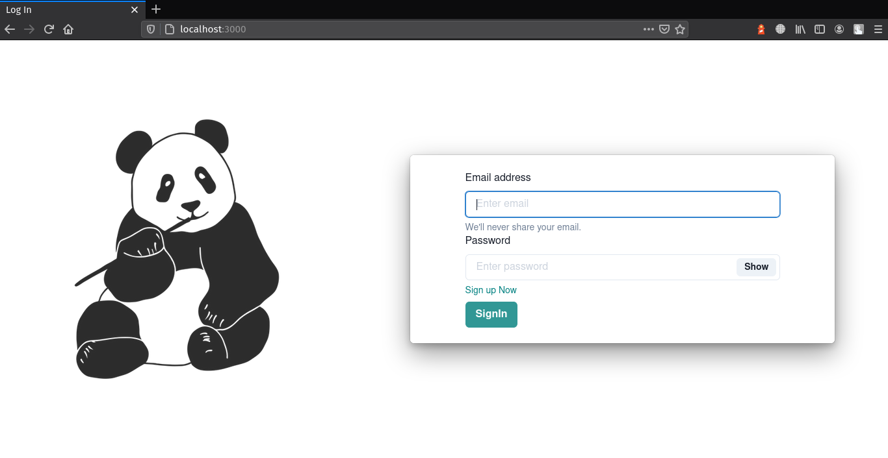
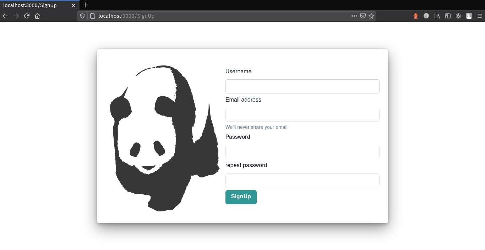
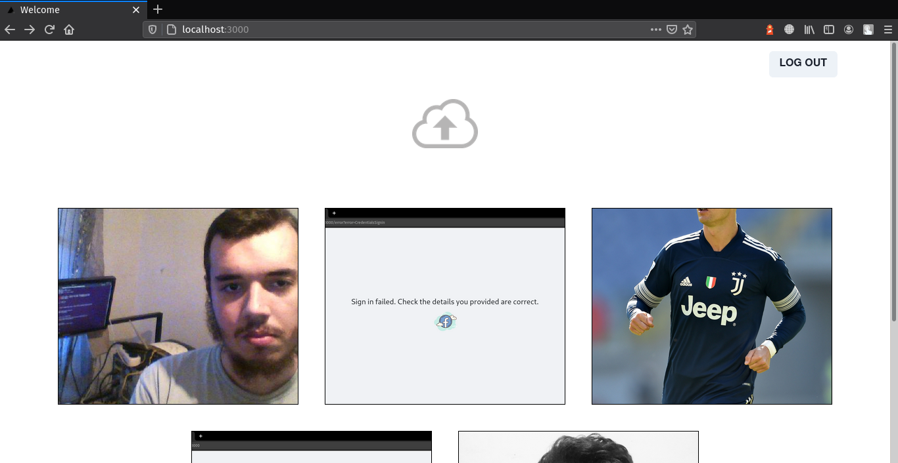
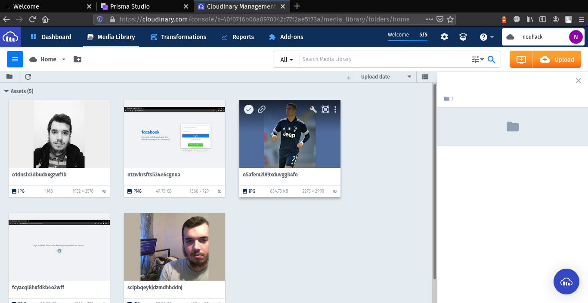
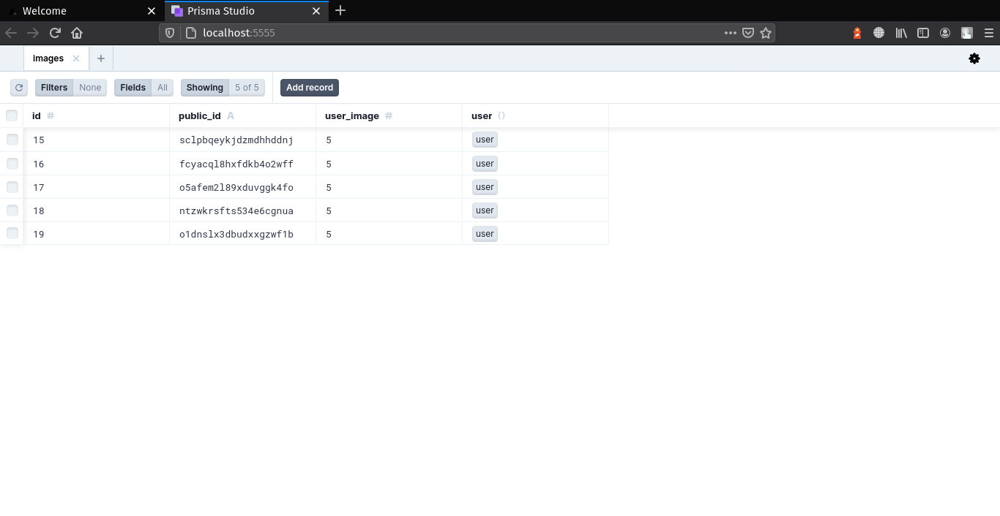
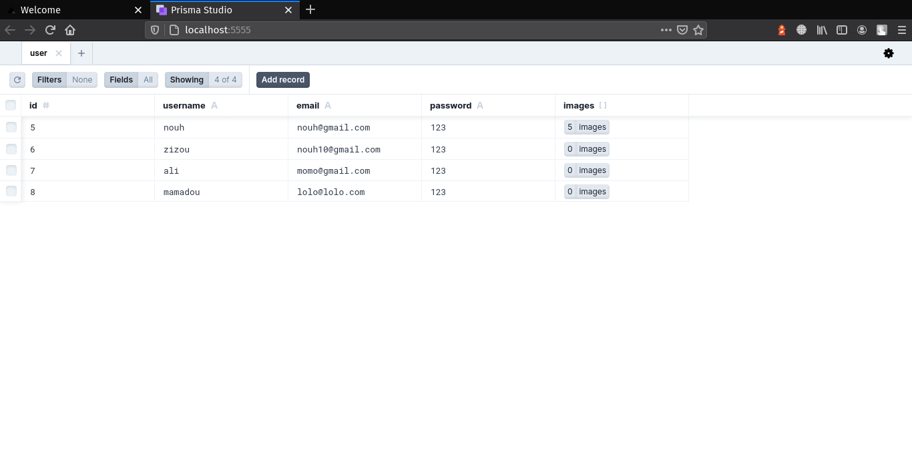

## About project
next js cloudinary is a [Next.js](https://nextjs.org/) app that uses [cloudinary](https://cloudinary.com/) as third party persistent file storage service and store images data in a database through Prisma ORM and [NextAuth](https://next-auth.js.org/getting-started/example) for jwt authentication and [chakra ui](https://chakra-ui.com/docs/getting-started) for UI.


## ScreenShots

- login page:



- sign up page:



- authentified user page:



- uploaded images to cloudinary cloud:



- save image uploaded data in a database:



- save users credentials in a database:



## Getting Started

First, run 

```bash
npm install # to install all dependencies including nextAuth
```

rename ``` .env.local.examle ``` to ``` .env.local ``` and add your keys

Open [http://localhost:3000](http://localhost:3000) with your browser to see the result.

You can start editing the page by modifying `pages/index.js`. The page auto-updates as you edit the file.

[API routes](https://nextjs.org/docs/api-routes/introduction) can be accessed on [http://localhost:3000/api/hello](http://localhost:3000/api/hello). This endpoint can be edited in `pages/api/hello.js`.

The `pages/api` directory is mapped to `/api/*`. Files in this directory are treated as [API routes](https://nextjs.org/docs/api-routes/introduction) instead of React pages.

## Learn More

To learn more about Next.js, take a look at the following resources:

- [Next.js Documentation](https://nextjs.org/docs) - learn about Next.js features and API.
- [Learn Next.js](https://nextjs.org/learn) - an interactive Next.js tutorial.
- [Chakra-ui](https://chakra-ui.com/docs/getting-started) - learn about Chakra-ui
- [Cloudinary](https://cloudinary.com/documentation) learn about cloudinary
- [Prisma ORM](https://www.prisma.io/docs/getting-started/quickstart-typescript) learn about Prisma ORM

You can check out [the Next.js GitHub repository](https://github.com/vercel/next.js/) - your feedback and contributions are welcome!

## Deploy on Vercel

The easiest way to deploy your Next.js app is to use the [Vercel Platform](https://vercel.com/new?utm_medium=default-template&filter=next.js&utm_source=create-next-app&utm_campaign=create-next-app-readme) from the creators of Next.js.

Check out our [Next.js deployment documentation](https://nextjs.org/docs/deployment) for more details.
